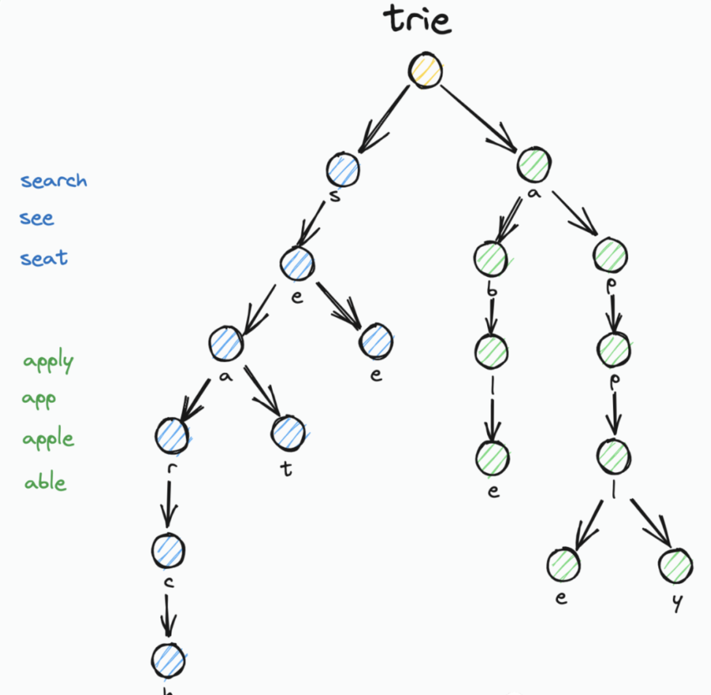
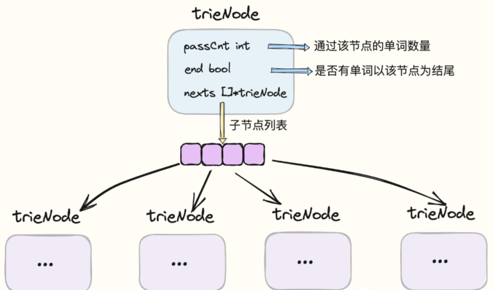
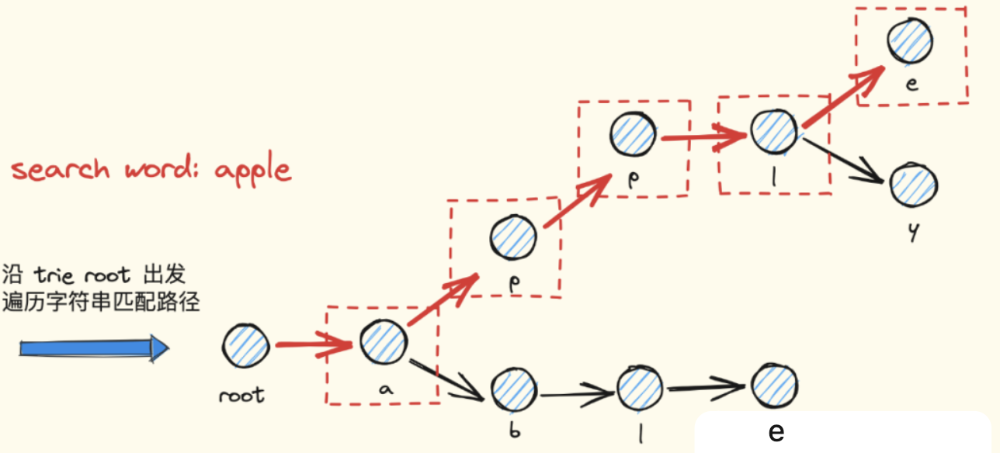
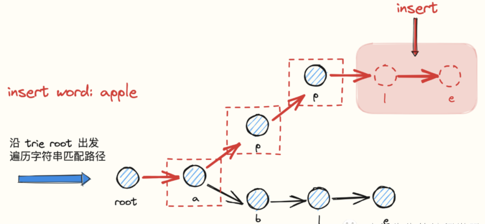

# trie 概念介绍

​		trie本身是一个多叉树结构，树中的每个节点存储一个字符，它与普通树状数据结构最大的差异在于，存储数据的key不存放于单个节点中，而是由从根节点 root 出发直到来到目标节点 target node 之间的沿途路径组成. 基于这样的构造方式，导致拥有相同前缀的字符串可以复用公共的父节点，直到在首次出现不同字符的位置才出现节点分叉，最终形成多叉树状结构。

下面我们通过一个案例加以说明：



如上图所示，我们描述一下插入 search、see、seat 三个单词的流程：

-   首先，trie 的根节点 root 内容为空. root 是所有节点的始祖、所有路径的起点
-   由于三个单词都有着公共的前缀 se，因此共享父节点 s、e
-   接下来，see 由于第三个字符为 e，与其他两个单词不同，以此 see 单独分叉出节点 e
-   seat、search 由于第三个字符都为 a，因此共享节点 a
-   seat、search 从第四个字符开始分叉，seat = sea + t；search = sea + r + c + h
-   至此，流程结束

​		回顾其结构特征，我们可以看出，trie 的优势是，当存储拥有公共前缀的内容时，可以在很大程度上节省空间提高节点利用率. 同时由于这种公共前缀的设计方式，也赋以了 trie 能够支持前缀频率统计以及前缀模糊匹配的功能.

# leetcode 试题

针对于前缀树，大家不妨使用 leetcode 上的一道编程算法题来练练手：

题号：208

题名：实现Trie（前缀树）

链接：https://leetcode.cn/problems/implement-trie-prefix-tree/submissions/

# 前缀树 Trie 实现

## 核心类

下面，我们就进入实战环节，一起通过 Go 语言来从零到一实现一棵 trie 树：



首先针对于 trie 树中的节点 node，我们进行类型定义：

```go
type trieNode struct {
    nexts   [26]*trieNode
    passCnt int
    end     bool
}
```

trieNode 中包含几个核心字段：

-   passCnt：记录通过当前节点的单词数量. 即，以根节点到当前节点所形成字符串作为前缀的单词数量
-   end：标识是否存在单词以当前节点为结尾. 即，存在以从根节点到当前节点所形成字符串作为内容的单词
-   nexts：子节点列表. trie树通过这一项，形成了父子节点一对多的映射关系，最终形成了多叉树的拓扑结构.

在本轮实现中，我们将单词的字符限定为 a-z 组成的 26 个小写字母. 在每个节点对应的 nexts 切片中，nexts[0] 表示下一个节点对应字符为 'a'，nexts[1] 对应为 'b'，以此类推，直到 nexts[25] 对应为 'z'.

下面是关于前缀树 trie 的定义，定义很简单，trie 中需要持有一个根节点 root 即可. 其中 root 是所有 trieNode 节点的始祖，其本身对应的字符为空.

```go
type Trie struct {
    root *trieNode
}


func NewTrie() *Trie {
    return &Trie{
        root: &trieNode{},
    }
}
```

## 查询流程

检索一个单词，判断其是否存在于 trie 树的处理流程：

```go
func (t *Trie) Search(word string) bool {
    // 查找目标节点，使得从根节点开始抵达目标节点沿路字符形成的字符串恰好等于 word
    node := t.search(word)
    return node != nil && node.end
}
```

-   Trie.Search 方法通过嵌套调用 Trie.search 方法，查找满足从根节点开始抵达该节点所形成字符串恰好等于检索单词 word 的目标节点
-   如果节点存在，并且节点的 end 标识为 true，代表 word 存在



下面是 Trie.search 方法的源码：

```go
func (t *Trie) search(target string) *trieNode {
    // 移动指针从根节点出发
    move := t.root
    // 依次遍历 target 中的每个字符
    for _, ch := range target {
        // 倘若 nexts 中不存在对应于这个字符的节点，说明该单词没插入过，返回 nil
        if move.nexts[ch-'a'] == nil {
            return nil
        }
        // 指针向着子节点移动
        move = move.nexts[ch-'a']
    }
   
    // 来到末尾，说明已经完全匹配好单词，直接返回这个节点
    // 需要注意，找到目标节点不一定代表单词存在，因为该节点的 end 标识未必为 true
    // 比如我们之前往 trie 中插入了 apple 这个单词，但是查找 app 这个单词时，预期的返回结果应该是不存在，此时就需要使用到 end 标识 进行区分
    return move
}
```

在 Trie.search 方法中：

-   移动指针 move 从 trie 的根节点 root 出发
-   依次遍历 word 中的字符，查看 move 的子节点列表 nexts 中否存在对应于该字符的子节点
-   如果对应子节点不存在，说明目标不存在
-   如果子节点存在，则将 move 指向该子节点，开始下一轮遍历
-   当遍历结束时，此时 move 对应的一定是 target 末尾的字符，直接返回 move 指向的节点
-   在外层方法 Trie.Search 中，会通过该节点的 end 标识，判断是否确实存在单词以该节点作为结尾

## 前缀匹配流程

下面是查看 trie 中是否存在单词以指定 prefix 作为前缀的处理流程.

在 StartWith 方法中，通过复用 trie.search 方法，返回全路径对应为 prefix 的节点. 根据该节点存在与否，可以判断出是否存在单词使用到了 prefix 前缀.

StartWith 流程与 Search 流程的区别在于，StartWith 无需对节点的 end 标识进行判断，因为此时我们的查询条件更宽松，只需要作前缀匹配，而非精确匹配.

```go
func (t *Trie) StartsWith(prefix string) bool {
    return t.search(prefix) != nil
}
```

## 前缀统计流程

下面展示一下 trie 树的另一种用法：给定一个 prefix，要求统计出以 prefix 作为前缀的单词数量.

```go
func (t *Trie) PassCnt(prefix string) int {
    node := t.search(prefix)
    if node == nil {
        return 0
    }
    return node.passCnt
}
```

关于这一点，我们保证在后续处理单词插入的 Insert 流程以及单词删除的 Erase 流程中，对每个节点维护好一个 passCnt 计数器，用于记录通过该节点的单词数量.

因此在此处的 PassCnt 流程中，我们只需要根据 prefix 找到对应节点，然后直接返回节点对应的 passCnt 值即可.

## 插入流程



下面展示了将一个单词 word 插入到 trie 树对应流程的实现源码：

```go
func (t *Trie) Insert(word string) {
    if t.Search(word) {
        return
    }

    move := t.root

    for _, ch := range word {
        if move.nexts[ch-'a'] == nil {
            move.nexts[ch-'a'] = &trieNode{}
        }
        move.nexts[ch-'a'].passCnt++
        move = move.nexts[ch-'a']
    }


    move.end = true
}
```

流程核心步骤包括：

-   插入新单词前，先检查一下，单词是否已存在了. 如果是的话，则直接结束流程，无需重复插入
-   移动指针 move 以根节点 root 作为起点
-   依次遍历 word 的每个字符，每轮判断当前节点的子节点列表 nexts 中，对应于字符的子节点是否已存在了
-   如果不存在，则首先创建出这个子节点
-   由于存在新单词的插入，我们需要对这个子节点的 passCnt 计数器累加 1
-   移动 move 指针，使其指向字符对应的子节点，并开启下一轮循环
-   重复上述流程，直到遍历结束，此时 move 所在位置一定对应的是单词结尾的字符. 我们需要把 move 指向节点的 end 标识置为 true，代表存在单词以此节点作为结尾

## 删除流程

最后展示一下，从前缀树 trie 中删除某个单词对应的实现源码：

```go
func (t *Trie) Erase(word string) bool {
    if !t.Search(word) {
        return false
    }

    move := t.root
    for _, ch := range word {
        move.nexts[ch-'a'].passCnt--
        if move.nexts[ch-'a'].passCnt == 0 {
            move.nexts[ch-'a'] = nil
            return true
        }
        move = move.nexts[ch-'a']
    }

    move.end = false
    return true
}
```

上述流程的核心步骤包括：

-   前置判断一下，拟删除单词 word 是否存在. 如果不存在，就提前结束流程，不用白费力气
-   移动指针 move 以根节点 root
-   依次遍历 word 中的每个字符，每次从当前节点子节点列表 nexts 中找到对应于字符的子节点
-   把该子节点的 passCnt 减 1
-   倘若发现子节点的 passCnt 被减为 0，则直接舍弃这个子节点，结束流程
-   倘若遍历来到单词末尾位置，则需要把对应节点的 end 标识置为 false

# trie应用介绍（GeoHash）

​		基于 trie 的特性，有一类很常用的应用场景就是搜索提示，比如当输入一个网址时，可以通过 trie 识别出用户可能的存在；当没有完全匹配的搜索结果时，也可以基于前缀返回最相似的可能.

除此之外，trie 存在另一个让我印象深刻的使用案例——geohash 算法.

简单来讲，geohash 是一种地址编码方式，通过将经纬度二维坐标通过递归二分的方式压缩成一个一维字符串，并能够在很大程度上保证拥有越长公共前缀的两个字符串之间的相对距离就越小.

由于 geohash 这种基于公共前缀圈定距离的实现方式，因此我们在存储基于 geohash 生成的大量位置信息时，通常会优先考虑使用 trie 树作为实现的数据结构.